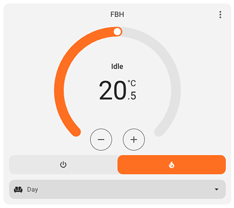
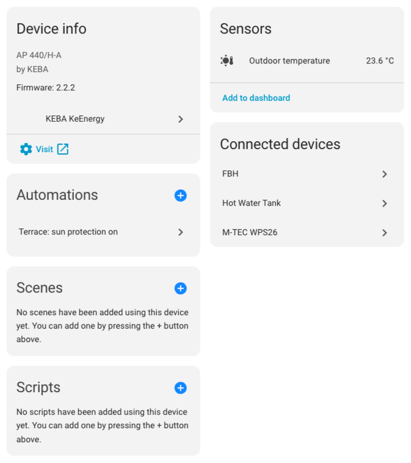
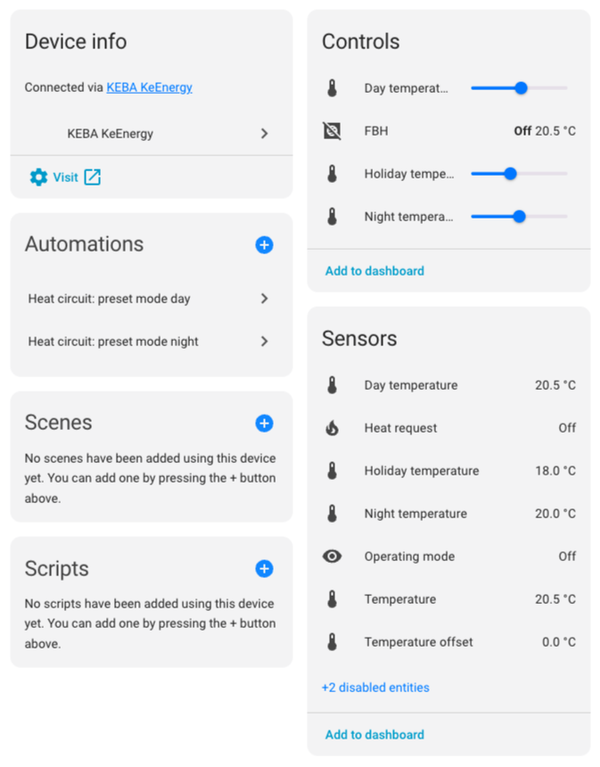
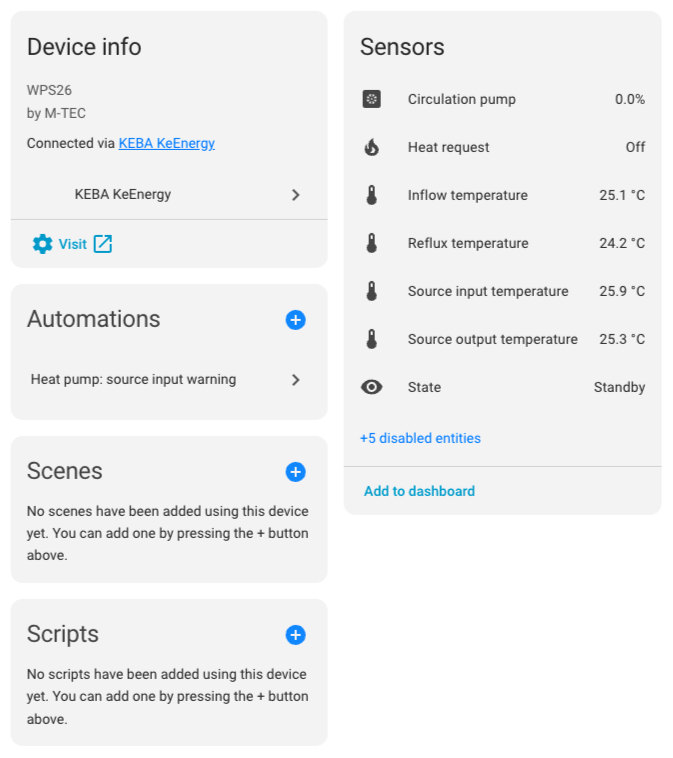
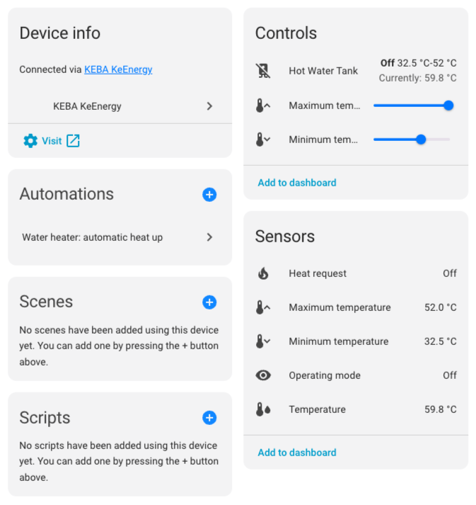

# KEBA KeEnergy integration

A Home Assistant integration for heaters with a KEBA KeEnergy control system.

Looking for more information? The [Wiki](https://github.com/superbox-dev/keba_keenergy/wiki) contains in-depth documentation.

## Geting started

1. Install this integration with HACS, or copy the contents of this repository into the
   `custom_components/keba_keenergy` directory.
2. Restart Home Assistant.
3. Start the configuration flow: go to `Configuration` -> `Integrations`, click the `+ Add Integration` and select
   `KEBA KeEnergy` from the list.
4. Add IP address or hostname of your KEBA KeEnergy device.
5. Enjoy :-)

## Donation

I put a lot of time into this project. If you like it, you can support me with a donation.

## Screenshots

### Climate card

### KEBA AP 440/H-A controller sensors

### Heat circuit controls and sensors

### Heat pump sensors

### Hot water tank controls and sensors

## Changelog

The changelog lives in the [CHANGELOG.md](CHANGELOG.md) document.
The format is based on [Keep a Changelog](https://keepachangelog.com/en/1.0.0/).

## Contributing

I'm happy about your contributions to the project!
You can get started by reading the [CONTRIBUTING.md](CONTRIBUTING.md).
